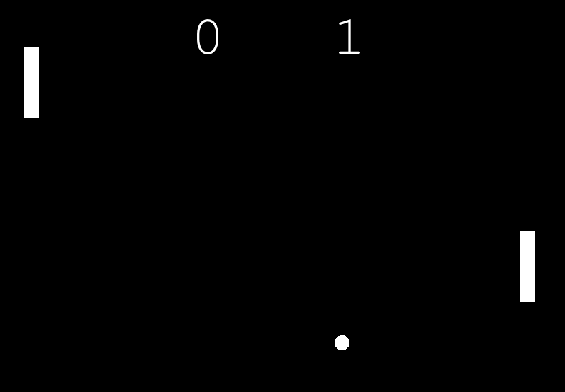

# PONG
## What is PONG?

Pong is a table tennis–themed twitch arcade sports video game, featuring simple two-dimensional graphics, manufactured by Atari and originally released on 29 November 1972. It is one of the earliest arcade video games; it was created by Allan Alcorn as a training exercise assigned to him by Atari co-founder Nolan Bushnell, but Bushnell and Atari co-founder Ted Dabney were surprised by the quality of Alcorn's work and decided to manufacture the game.
## Files included

- main.py _(Python Main File)_
- ball.py _(Python Class File)_
- paddle.py _(Python Class File)_
- pong.txt _(Just some information)_
- scoreboard.py _(Python Class File)_
- README.md _(Just some information)_

## Screenshot

