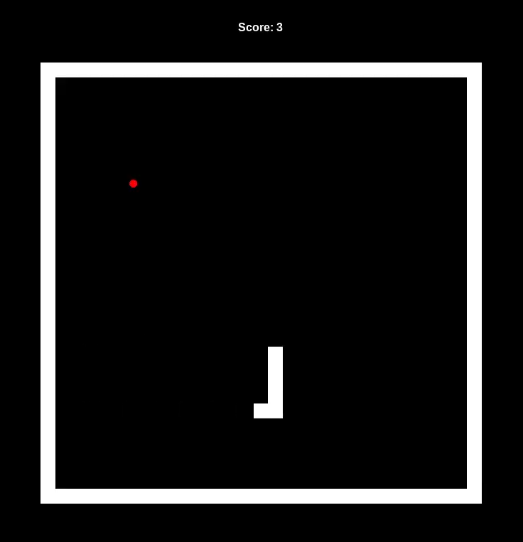

# SNAKE GAME
## What is snake game?

This is simple game known from Nokia 3310.
You are in control of constantly moving snake.
You are able to change it direction.
Snake's goal is to eat as masy fruits as you can.
When snake eats a fruit lenght of tail is extending.
If snake hit wall or it's tail the game is over.

## Files included

- main.py _(Python Game File)_
- apple.py _(Python Class File)_
- scoreboard.py _(Python Class File)_
- wall.py _(Python Class File)_
- snake.py _(Python Class File)_
- README.md _(Just some information)_
- SnakeGame.drawio.pdf _(Flow Chart)_

## Screenshot

